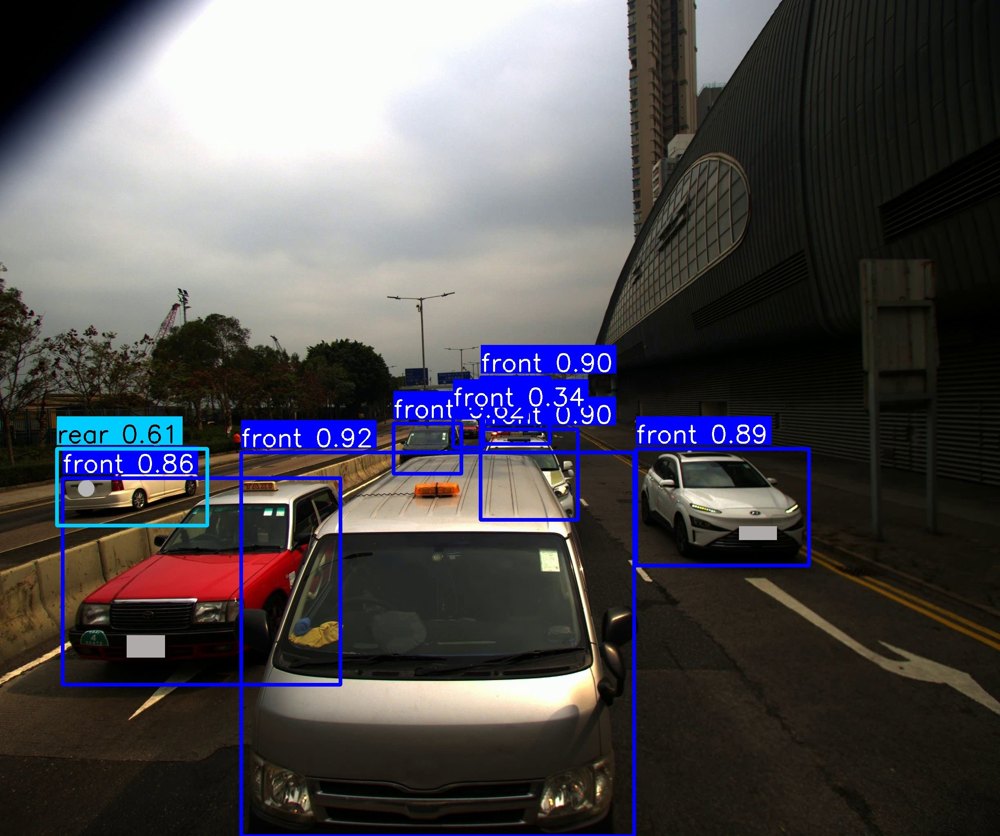

# YOLOv11-Vehicle-Direction-Detection
A YOLOv11-based model and demo for detecting vehicle directions (e.g., front or rear) in images.

This repository contains a sample script and pretrained model to detect object direction (e.g., front or rear view of vehicles) using the YOLOv11 architecture.

## 🔍 What It Does

Given an input image, the model detects objects and classifies their orientation as either `front`, `rear`, or `unknown`. The result is an annotated image with bounding boxes and labels.

## 🚀 Getting Started

### 1. Install Dependencies

You will need:

- Python >= 3.11  
- OpenCV (`pip install opencv-python`)  
- ultralytics (`pip install ultralytics`)

### 2. Run the Script


```bash
python sample_code.py
```

### ✅ Download the Model

Due to GitHub's file size limit (100 MB), the model file `best.pt` is stored using [Git LFS](https://git-lfs.github.com/).

If you **haven’t installed Git LFS**, please do so before cloning or pulling this repository:

```bash
git lfs install
```

### 📷 Example Output


